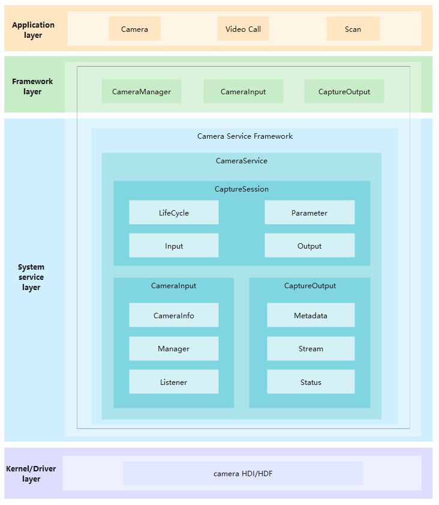

# Camera<a name="EN-US_TOPIC_0000001101564782"></a>

- [Introduction<a name="section11660541593"></a>](#introduction)
    - [Basic Concepts<a name="sectionbasicconcepts"></a>](#basic-concepts)
- [Directory Structure<a name="section176641621345"></a>](#directory-structure)
- [Usage Guidelines<a name="usage-guidelines"></a>](#usage-guidelines)
    - [To Capture a Photo](#to-capture-a-photo)
    - [To Start and Stop Preview](#to-start-and-stop-preview)
    - [To Record Video](#to-record-video)
    - [To Switch Between Camera Devices](#to-switch-between-camera-devices)
- [Repositories Involved<a name="section16511040154318"></a>](#repositories-involved)

## Introduction<a name="section11660541593"></a>

The  **camera\_standard**  repository enables your application to provide camera functions. You can access and operate the camera device and develop new functions through open APIs. Common operations include preview, photographing and video recording.

### Basic Concepts<a name="sectionbasicconcepts"></a>

-   Capture Photo

    This function is used to capture a photo.

-   Preview

    This function repeatedly captures multiple frames in the buffer once the camera is started. It is used to preview the subject before capturing a photo or start recording a video.

-   Record Video

    This function repeatedly captures multiple frames in the buffer once the recording is started and continues till the recording is stopped. It is used for video recording.

**Figure  1**  Camera architecture<a name="fig310889397"></a>



## Directory Structure<a name="section176641621345"></a>

The structure of the repository directory is as follows:

```
/foundation/multimedia/camera_standard  # Camera code
├── frameworks                          # Framework code
│   ├── innerkitsimpl                   # Internal Native API Implementation
│   │   ├── camera                      # Camera Framework Implementation
│   │   └── metadata                    # Metadata Implementation
│   └── kitsimpl                        # External JS API Implementation
│       └── camera_napi                 # Camera NAPI Implementation
├── interfaces                          # Interfaces
│   ├── innerkits                       # Internal Native APIs
│   └── kits                            # External JS APIs
├── LICENSE                             # License file
├── ohos.build                          # Build file
├── sa_profile                          # Service configuration profile
└── services                            # Service code
    ├── camera_service                  # Camera Service Implementation
    └── etc                             # Camera Service Init Configuration
```


## Usage Guidelines<a name="usage-guidelines"></a>

### To Capture a Photo

Steps to capture a photo:

1. Create the buffer consumer listener(**CaptureSurfaceListener**) to save the image.
    ```
    class CaptureSurfaceListener : public IBufferConsumerListener {
    public:
        int32_t mode_;
        sptr<Surface> surface_;
    
        void OnBufferAvailable() override
        {
            int32_t flushFence = 0;
            int64_t timestamp = 0;
            OHOS::Rect damage; // initialize the damage
    
            OHOS::sptr<OHOS::SurfaceBuffer> buffer = nullptr;
            surface_->AcquireBuffer(buffer, flushFence, timestamp, damage);
            if (buffer != nullptr) {
                void *addr = buffer->GetVirAddr();
                int32_t size = buffer->GetSize();
    
                // Save the buffer(addr) to a file.
    
                surface_->ReleaseBuffer(buffer, -1);
            }
        }
    };
    ```

2. Get the Camera Manager Instance and retrieve the camera object list.

    ```
    sptr<CameraManager> camManagerObj = CameraManager::GetInstance();
    std::vector<sptr<CameraInfo>> cameraObjList = camManagerObj->GetCameras();
    ```

3. Create the Capture Session

    ```
    sptr<CaptureSession> captureSession = camManagerObj->CreateCaptureSession();
    ```

4. Begin configuring the Capture Session.

    ```
    int32_t result = captureSession->BeginConfig();
    ```

5. Create the Camera Input using the Camera Object.

    ```
    sptr<CaptureInput> cameraInput = camManagerObj->CreateCameraInput(cameraObjList[0]);
    ```

6. Add the Camera Input to the Capture Session.

    ```
    result = captureSession->AddInput(cameraInput);
    ```

7. Create the Consumer Surface and register listerner for buffer updates. The photo width and height can be configured to the supported resolution which is 1280x960.

    ```
    sptr<Surface> photoSurface = Surface::CreateSurfaceAsConsumer();
    int32_t photoWidth = 1280;
    int32_t photoHeight = 960;
    photoSurface->SetDefaultWidthAndHeight(photoWidth, photoHeight);
    sptr<CaptureSurfaceListener> capturelistener = new CaptureSurfaceListener();
    capturelistener->mode_ = MODE_PHOTO;
    capturelistener->surface_ = photoSurface;
    photoSurface->RegisterConsumerListener((sptr<IBufferConsumerListener> &)capturelistener);
    ```

8. Create a Photo Output with Surface created above.

    ```
    sptr<CaptureOutput> photoOutput = camManagerObj->CreatePhotoOutput(photoSurface);
    ```

9. Add the Photo Output to the Capture Session.

    ```
    result = captureSession->AddOutput(photoOutput);
    ```

10. Commit the configuration to Capture Session.

    ```
    result = captureSession->CommitConfig();
    ```

11. Capture the Photo.

    ```
    result = ((sptr<PhotoOutput> &)photoOutput)->Capture();
    ```

12. Release the Capture Session resources.

    ```
    captureSession->Release();
    ```

### To Start and Stop Preview

Steps to start and stop preview:

1. Get the Camera Manager Instance and retrieve the camera object list.

    ```
    sptr<CameraManager> camManagerObj = CameraManager::GetInstance(); 
    std::vector<sptr<CameraInfo>> cameraObjList = camManagerObj->GetCameras();
    ```

2. Create the Capture Session

    ```
    sptr<CaptureSession> captureSession = camManagerObj->CreateCaptureSession();
    ```

3. Begin configuring the Capture Session.

    ```
    int32_t result = captureSession->BeginConfig();
    ```

4. Create the Camera Input using the Camera Object.

    ```
    sptr<CaptureInput> cameraInput = camManagerObj->CreateCameraInput(cameraObjList[0]);
    ```

5. Add the Camera Input to the Capture Session.

    ```
    result = captureSession->AddInput(cameraInput); 
    ```

6. Create a Preview Output with Surface obtained from Window Manager to render on display. The preview width and Height can be configured as per the supported resolutions which are 640x480 or 832x480. And to save to a file, can follow the step to create Surface and register listerner for buffer updates mentioned in capture photo.

    ```
    int32_t previewWidth = 640;
    int32_t previewHeight = 480;
    sptr<CaptureOutput> previewOutput = camManagerObj->CreateCustomPreviewOutput(previewSurface, previewWidth, previewHeight);
    ```

7. Add the Preview Output to the Capture Session.

    ```
    result = captureSession->AddOutput(previewOutput);
    ```

8. Commit the configuration to Capture Session.

    ```
    result = captureSession->CommitConfig();
    ```

9. Start the Preview

    ```
    result = captureSession->Start();
    ```

10. Stop the Preview when needed.

    ```
    result = captureSession->Stop();
    ```


    ```
    captureSession->Release();
    ```

### To Record Video

Steps to record Video:

1. Get the Camera Manager Instance and retrieve the camera object list.

    ```
    sptr<CameraManager> camManagerObj = CameraManager::GetInstance();
    std::vector<sptr<CameraInfo>> cameraObjList = camManagerObj->GetCameras();
    ```

2. Create the Capture Session

    ```
    sptr<CaptureSession> captureSession = camManagerObj->CreateCaptureSession();
    ```

3. Begin configuring the Capture Session.

    ```
    int32_t result = captureSession->BeginConfig();
    ```

4. Create the Camera Input using the Camera Object.

    ```
    sptr<CaptureInput> cameraInput = camManagerObj->CreateCameraInput(cameraObjList[0]);
    ```

5. Add the Camera Input to the Capture Session.

    ```
    result = captureSession->AddInput(cameraInput);
    ```

6. Create a Video Output with Surface obtained from Recoder to MUX with audio and save the file. And to save just Video buffer to a file, can follow the step to create Surface and register listerner for buffer updates mentioned in capture photo. The video resolution can be configured from supported resolutions which are 1280x720 or 640x360 while setting the recorder configurations.

    ```
    sptr<CaptureOutput> videoOutput = camManagerObj->CreateVideoOutput(videoSurface);
    ```

7. Add the Video Output to the Capture Session.

    ```
    result = captureSession->AddOutput(videoOutput);
    ```

8. Commit the configuration to Capture Session.

    ```
    result = captureSession->CommitConfig();
    ```

9. Start the Video Recording.

    ```
    result = ((sptr<VideoOutput> &)videoOutput)->Start();
    ```

10. Stop the recording when needed.

    ```
    result = ((sptr<VideoOutput> &)videoOutput)->Stop();
    ```

11. Release the Capture Session resources.

    ```
    captureSession->Release();
    ```

### To Switch Between Camera Devices

Below steps demonstrate how to switch between the camera devices. Initially a video output is added to the capture session. If user wish to switch between cameras, existing input and output have to be removed first and then add a new input and output(i.e., photo output in this case).

1. Get the Camera Manager Instance and retrieve the camera object list.

    ```
    sptr<CameraManager> camManagerObj = CameraManager::GetInstance();
    std::vector<sptr<CameraInfo>> cameraObjList = camManagerObj->GetCameras();
    ```

2. Create the Capture Session

    ```
    sptr<CaptureSession> captureSession = camManagerObj->CreateCaptureSession();
    ```

3. Begin configuring the Capture Session.

    ```
    int32_t result = captureSession->BeginConfig();
    ```

4. Create the Camera Input using the Camera Object.

    ```
    sptr<CaptureInput> cameraInput = camManagerObj->CreateCameraInput(cameraObjList[0]);
    ```

5. Add the Camera Input to the Capture Session.

    ```
    result = captureSession->AddInput(cameraInput);
    ```

6. Create a Video Output with Surface

    ```
    sptr<CaptureOutput> videoOutput = camManagerObj->CreateVideoOutput(videoSurface);
    ```

7. Add the Video Output to the Capture Session.

    ```
    result = captureSession->AddOutput(videoOutput);
    ```

8. Commit the configuration to Capture Session.

    ```
    result = captureSession->CommitConfig();
    ```

9. Start the Video Recording.

    ```
    result = ((sptr<VideoOutput> &)videoOutput)->Start();
    ```

10. Stop the recording when needed.

    ```
    result = ((sptr<VideoOutput> &)videoOutput)->Stop();
    ```

11. In order to remove camera input and output, configure the Capture Session again.

    ```
    int32_t result = captureSession->BeginConfig();
    ```

12. Remove the Camera Input in the new capture session configuration.

    ```
    int32_t result = captureSession->RemoveInput(cameraInput);
    ```

13. Remove the Camera Output as well.

    ```
    int32_t result = captureSession->RemoveOutut(videoOutput);
    ```

14. Create new camera input, add it to capture session

    ```
    sptr<CaptureInput> cameraInput2 = camManagerObj->CreateCameraInput(cameraObjList[1]);
    result = captureSession->AddInput(cameraInput2);
    ```

15. For PhotoOutput, create the Consumer Surface and register listerner for buffer updates. The surface will be used for creation of photo output. Add the photo output to the capture session once it is successfully created.

    ```
    // Get the surface
    sptr<Surface> photoSurface = Surface::CreateSurfaceAsConsumer();
    int32_t photoWidth = 1280;
    int32_t photoHeight = 960;
    photoSurface->SetDefaultWidthAndHeight(photoWidth, photoHeight);
    sptr<CaptureSurfaceListener> capturelistener = new CaptureSurfaceListener();
    capturelistener->mode_ = MODE_PHOTO;
    capturelistener->surface_ = photoSurface;
    photoSurface->RegisterConsumerListener((sptr<IBufferConsumerListener> &)capturelistener);

    // Create the Photo Output
    sptr<CaptureOutput> photoOutput = camManagerObj->CreatePhotoOutput(photoSurface);

    // Add the output to the capture session
    result = captureSession->AddOutput(photoOutput);
    ```

16. Commit the configuration to Capture Session.

    ```
    result = captureSession->CommitConfig();
    ```

17. Capture the Photo.

    ```
    result = ((sptr<PhotoOutput> &)photoOutput)->Capture();
    ```


18. Release the Capture Session resources.

    ```
    captureSession->Release();
    ```

## Repositories Involved<a name="section16511040154318"></a>

[multimedia\_camera\_standard](https://gitee.com/openharmony/multimedia_camera_standard)

