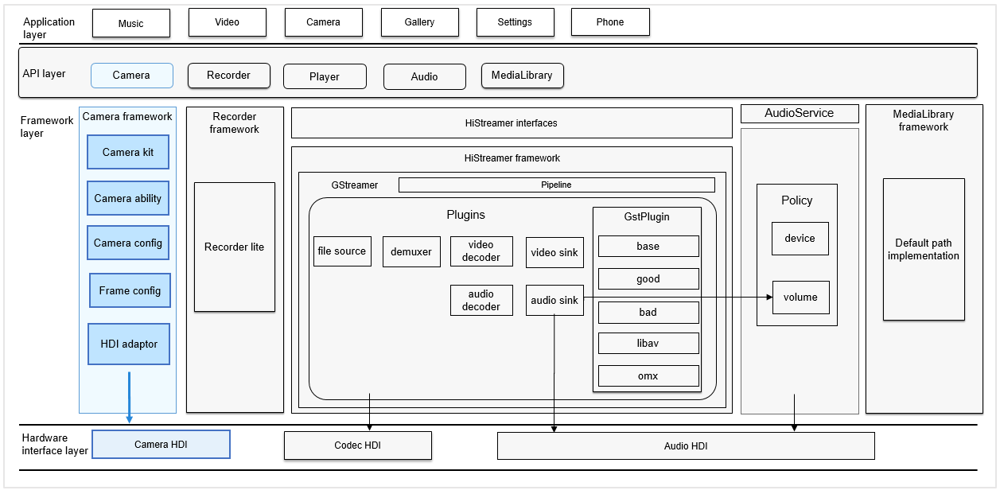

# Camera<a name="EN-US_TOPIC_0000001101564782"></a>

-   [Introduction](#section11660541593)
-   [Directory Structure](#section176641621345)
-   [Repositories Involved](#section16511040154318)

## Introduction<a name="section11660541593"></a>

The  **camera\_standard**  repository enables your application to provide camera functions. You can access and operate the camera device and develop new functions through open APIs. Common operations include preview, photographing, and video recording.

**Figure  1**  Position in the subsystem architecture<a name="fig310889397"></a>  


## Directory Structure<a name="section176641621345"></a>

The structure of the repository directory is as follows:

```
/foundation/multimedia/camera
├── frameworks                          # Framework code
│   ├── include                         # Header files required by the framework
│   └── src                             # Framework implementation
├── interfaces                          # External APIs
│   └── kits                            # External API files
├── LICENSE                             # License file
└── ohos.build                          # Build file
```

## Repositories Involved<a name="section16511040154318"></a>

multimedia\_camera\_standard

