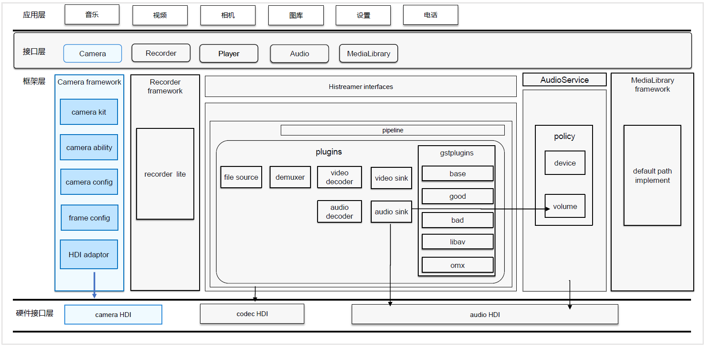

# Camera组件<a name="ZH-CN_TOPIC_0000001101564782"></a>

-   [简介](#section11660541593)
-   [目录](#section176641621345)
-   [相关仓](#section16511040154318)

## 简介<a name="section11660541593"></a>

相机组件支持相机业务的开发，开发者可以通过已开放的接口实现相机硬件的访问、操作和新功能开发，最常见的操作如：预览、拍照和录像等。

**图 1**  camera组件架构图<a name="fig310889397"></a>  


## 目录<a name="section176641621345"></a>

仓目录结构如下：

```
/foundation/multimedia/camera_standard  # 相机组件业务代码
├── frameworks                          # 框架代码
│   ├── include                         # 框架所需头文件
│   └── src                             # 框架层实现
├── interfaces                          # 外部接口层
│   └── kits                            # 外部接口文件
├── LICENSE                             # 证书文件
└── ohos.build                          # 编译文件
```

## 相关仓<a name="section16511040154318"></a>

媒体子系统仓：multimedia\_camera\_standard

